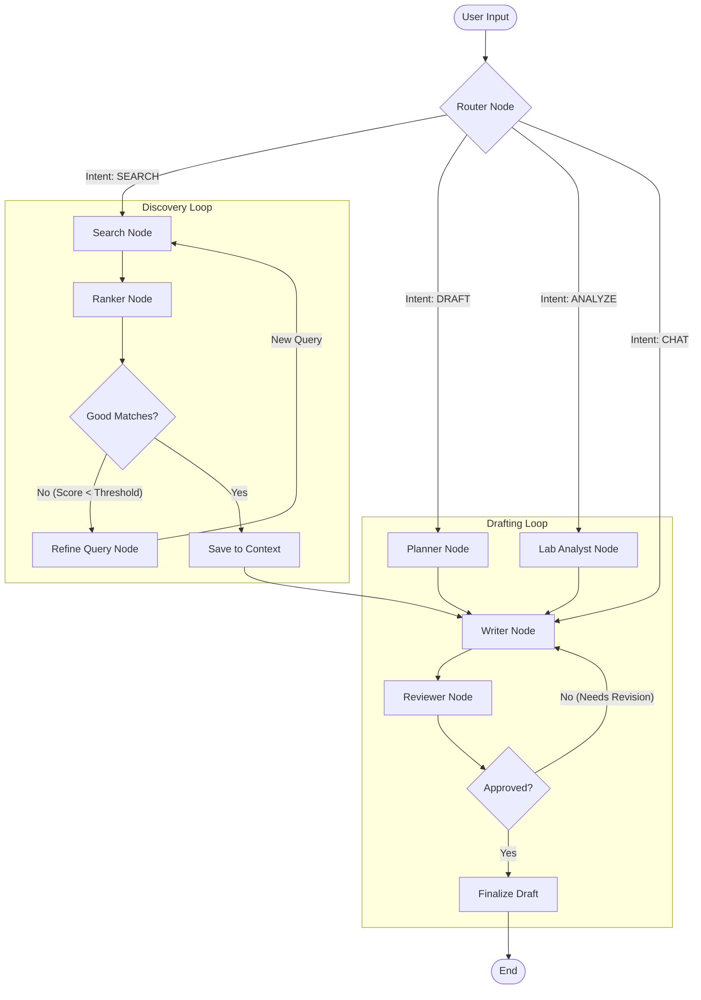

# ScholarFlow Agent Architecture (LangGraph)

This document explains how **LangGraph** manages the autonomous research workflows in ScholarFlow. Unlike linear chains (e.g., LangChain `SequentialChain`), ScholarFlow uses a **cyclic state machine** that can loop, self-correct, and route dynamically based on intent.

---

## 1. High-Level Architecture

The system is built as a single `StateGraph` with a shared `ResearchState`. It features two primary "self-correction loops":

1.  **Discovery Loop:** Searches for papers $\rightarrow$ Ranks relevance $\rightarrow$ If poor, Refines Query & Retries.
2.  **Drafting Loop:** Writes draft $\rightarrow$ Reviews (Critique) $\rightarrow$ If needs improvement, Revises.

### Visual Workflow



---

## 2. Shared State Schema (`ResearchState`)

The `ResearchState` (defined in `app/agents/state.py`) is a strictly typed dictionary passed between all nodes. It acts as the "memory" of the agent.

| Field | Type | Description |
| :--- | :--- | :--- |
| `query` | `str` | The original user research question. |
| `found_papers` | `List[Dict]` | Raw search results from ArXiv/Semantic Scholar. |
| `ranked_papers` | `List[Dict]` | Papers scored by relevance (0.0 - 1.0). |
| `search_iteration` | `int` | Counter to prevent infinite search loops (Max: 3). |
| `refined_query` | `str` | The LLM-optimized query used for retries. |
| `current_draft` | `Dict` | The ongoing manuscript section content. |
| `critique_feedback` | `str` | Feedback from the Reviewer node ("Too vague", "Missing citations"). |
| `revision_count` | `int` | Counter to prevent infinite revision loops (Max: 2). |
| `intent` | `str` | Classification result (`SEARCH`, `DRAFT`, `ANALYZE`). |

---

## 3. Node Definitions (`app/agents/nodes.py`)

### 1. Router Node
*   **Function:** `router_node`
*   **Model:** `gemini-2.0-flash` (Low latency)
*   **Prompt Strategy:** Zero-shot classification with predefined categories.
*   **Logic:** Analyzes query semantics to determine if the user wants to *find papers* (`SEARCH`), *write content* (`DRAFT`), or *analyze data* (`ANALYZE`).
*   **Output:** Sets `state["intent"]` key.

### 2. Search Node (Discovery)
*   **Function:** `search_node`
*   **Model:** `gemini-2.0-flash` (for Query Analysis)
*   **Tools:** `ArxivRetriever`, `SemanticScholarAPI`
*   **Logic:** 
    1.  **Query Decomposition:** Uses LLM to break complex questions into "Atomic Search Queries" (e.g., "RAG" $\rightarrow$ "Retrieval Augmented Generation implementation").
    2.  **Multi-Source Search:** Hits external APIs in parallel.
    3.  **Deduplication:** Merges results by title normalization.
*   **Input:** `state["refined_query"]` (if retry) or `state["query"]`.

### 3. Ranker Node (Discovery)
*   **Function:** `ranker_node`
*   **Model:** `gemini-2.5-pro`
*   **Prompt Strategy:** "Judge Evaluator" persona.
*   **Logic:** 
    1.  Feeds (Query + Paper Abstract) pairs to the LLM.
    2.  Asks for a relevance score (0.0 - 1.0) and a one-sentence justification.
    3.  Sorts `state["ranked_papers"]` descending by score.

### 4. Refine Query Node (Correction)
*   **Function:** `refine_query_node`
*   **Model:** `gemini-2.5-pro`
*   **Logic:** Triggered only if `Ranker` returns low scores. 
    *   *Input:* Failed query + Zero results message.
    *   *Action:* LLM generates a broader or synonymous query (e.g., "AI agents" $\rightarrow$ "Autonomous interacting agents").

### 5. Writer Node (Drafting)
*   **Function:** `writer_node`
*   **Model:** `gemini-2.5-pro` (High throughput)
*   **Prompt Strategy:** Chain-of-Thought with Context Injection.
*   **Logic:** 
    1.  **Context Assembly:** Retrieves `literature_context` (external papers) + `research_context` (student lab data).
    2.  **Dynamic Weighting:** Uses `get_context_weights()` heuristic:
        *   *Introduction:* 80% Literature / 20% Lab Data
        *   *Methods:* 20% Literature / 80% Lab Data
    3.  **Generation:** Produces markdown-formatted academic text.

### 6. Reviewer Node (Drafting)
*   **Function:** `reviewer_node`
*   **Model:** `gemini-2.5-pro` (System 2 thinking simulation)
*   **Prompt Strategy:** Persona-based ("Senior Editor at Nature").
*   **Logic:** 
    *   Checks for *Hallucinations* (citations not in context).
    *   Checks for *Academic Tone* (passive voice, formal vocabulary).
    *   If quality < Threshold: Populates `critique_feedback`.

### 7. Lab Analyst Node (Multi-Modal)
*   **Function:** `lab_analyst_node`
*   **Model:** `gemini-pro-vision` (Multi-modal)
*   **Logic:** 
    *   Accepts image file paths (charts, plots).
    *   Extracts numerical trends and data points.
    *   Converts visual data into textual descriptions for the `Writer` node.

---

## 4. Conditional Edge Logic (`app/agents/graph.py`)

LangGraph uses python functions to determine the "Next Step" at split points.

**1. Discovery Control (`should_refine_search`)**
```python
def should_refine_search(state):
    # Check if we have good papers
    top_score = state["ranked_papers"][0]["score"]
    
    # If bad results AND we haven't tried too many times...
    if top_score < 0.7 and state["search_iteration"] < 3:
        return "refine_query"  # LOOP BACK
    
    return "save_to_context"   # PROCEED
```

**2. Drafting Control (`should_revise_draft`)**
```python
def should_revise_draft(state):
    # If Reviewer complained AND we haven't revised too many times...
    if state["needs_revision"] and state["revision_count"] < 2:
        return "writer"  # LOOP BACK
        
    return "reviewer_approved" # FINISH
```

---

## 5. How to Run & Debug

The graph is compiled in `graph.py` and exposed as `research_graph`.

**Running via API:**
The backend `main.py` invokes it using `.ainvoke()`:
```python
final_state = await research_graph.ainvoke({
    "query": "Impact of Transformers on NLP",
    "project_id": "123"
})
```

**Streaming Logs:**
The frontend receives updates via Server-Sent Events (SSE). Each node appends to `state["logs"]`, which we stream back to the UI to show the "Thinking..." animation.
