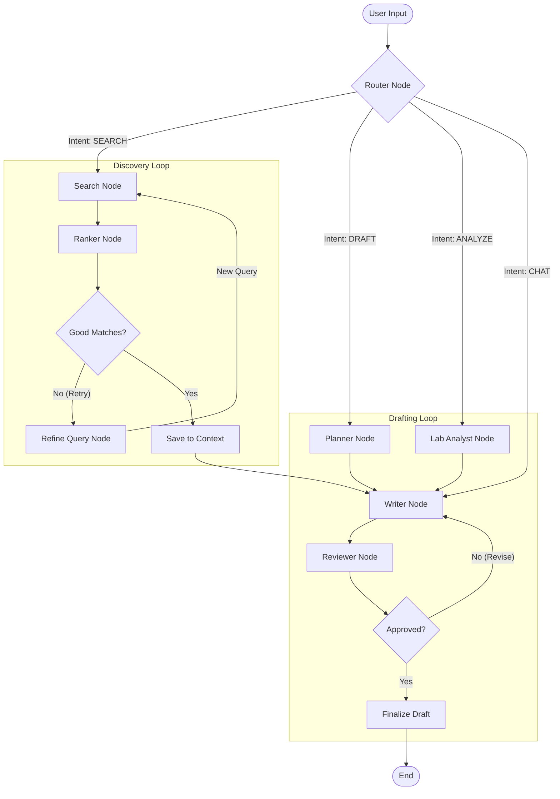

# ScholarFlow System Architecture

This document provides a comprehensive overview of the ScholarFlow system architecture, covering the Frontend, Backend, and the core LangGraph Agent workflow.

## 1. High-Level System Architecture

ScholarFlow follows a modern Client-Server architecture with a React frontend and a FastAPI backend, integrated with external AI and Academic APIs.

```mermaid
graph TD
    subgraph "Frontend (React + Vite)"
        UI[User Interface]
        Store[Zustand Stores]
        Query[TanStack Query]
        Stream[SSE Stream Handler]
        
        UI --> Store
        UI --> Query
        UI --> Stream
    end

    subgraph "Backend (FastAPI)"
        API[API Router]
        Auth[Auth Middleware]
        DB_ORM[SQLAlchemy ORM]
        
        subgraph "LangGraph Agent"
            Graph[StateGraph]
            Nodes[Agent Nodes]
            State[ResearchState]
            
            Graph --> Nodes
            Nodes --> State
        end
        
        API --> Graph
        API --> DB_ORM
    end

    subgraph "Data Storage"
        SQLite[(SQLite Database)]
        FileSystem[File System (Uploads)]
        
        DB_ORM --> SQLite
        API --> FileSystem
    end

    subgraph "External Services"
        Gemini[Google Gemini API]
        Arxiv[ArXiv API]
        Semantic[Semantic Scholar API]
        
        Nodes --> Gemini
        Nodes --> Arxiv
        Nodes --> Semantic
    end

    %% Data Flow Connections
    Query -- "REST Requests" --> API
    Stream -- "Server-Sent Events" --> API
    
    %% Internal Backend Flow
    API -- "Invoke Agent" --> Graph
    Nodes -- "Save Papers/Drafts" --> DB_ORM
```

## 2. Component Ecosystem

### Frontend (`/`)
*   **Framework:** React 19 + Vite
*   **State Management:**
    *   **Zustand:** Global app state (`appStore`), Project state (`projectStore`), and Agent state (`agentStore`).
    *   **TanStack Query:** Server state management, caching, and background updates.
*   **Key Components:**
    *   **Workspaces:** Divided into `Discovery` (Search), `Reading` (PDF consumption), and `Studio` (Writing/Co-authoring).
    *   **Streaming:** Custom hooks (`useStreaming`) to handle Server-Sent Events (SSE) for real-time agent "thinking" logs.
    *   **Tools:** `monaco-editor` for the writing studio, `react-pdf` for rendering papers.

### Backend (`/backend`)
*   **Framework:** FastAPI
*   **Database:** SQLite with SQLAlchemy ORM (lightweight, zero-config for local deployment).
*   **API Structure:**
    *   `/api/v1/chat`: Endpoints for triggering the LangGraph agent.
    *   `/api/v1/projects`: Project CRUD operations.
    *   `/api/v1/papers`: Paper management and library operations.
*   **LangGraph Integration:**
    *   The core logic resides in `app.agents`. The API endpoint initiates an agent run using `graph.ainvoke()`.
    *   Logs and updates are streamed back to the client using FastAPI's `StreamingResponse`.

---

## 3. LangGraph Agent Architecture ("The Brain")

The agent is designed as a **Cyclic State Graph**, distinguishing it from linear chains. It has memory (`ResearchState`) and can loop back to previous steps to correct mistakes (e.g., "Search yielded bad results, try again").

### The Research Graph



### Detailed Node Explanations

1.  **Router Node**:
    *   **Role:** The traffic controller.
    *   **Logic:** Uses Gemini Flash (fast) to classify user intent into `SEARCH`, `DRAFT`, `ANALYZE`, or `CHAT`.

2.  **Discovery Loop (Search & Refine)**:
    *   **Search Node:** Decomposes queries and searches ArXiv/Semantic Scholar in parallel.
    *   **Ranker Node:** Uses an LLM "Judge" to read abstracts and score papers (0.0 - 1.0) on relevance.
    *   **Refine Query Node:** *Conditional.* If the Ranker says matches are poor, this node rewrites the query to be broader or more specific, then loops back to `Search`.
    *   **Save to Context:** Commits validated papers to the database (`LibraryItem`).

3.  **Drafting Loop (Write & Review)**:
    *   **Planner Node:** Generates a structured outline (Introduction, Methods, etc.) before writing begins.
    *   **Lab Analyst Node:** *Multimodal.* Reads charts/graphs (images) and converts them into textual data summaries for the writer.
    *   **Writer Node:** The core content generator. It takes the *Outline*, *Context Papers*, and *Lab Data* to write a section.
    *   **Reviewer Node:** Simulates a "Senior Editor". Checks for hallucinations (citations not in source), tone, and clarity.
    *   **Revision Logic:** If the Reviewer rejects the draft, it loops back to the `Writer` with specific feedback (`critique_feedback`).

### Data Flow Example: "Find papers on RAG"

1.  **Frontend**: User types "Find papers on RAG".
2.  **Backend**: `POST /chat` receives request.
3.  **Router**: Sees "Find papers" -> Routes to `SEARCH`.
4.  **Search Node**: Queries APIs, finds 10 papers.
5.  **Ranker**: Scores them. Top score is 0.4 (Low).
6.  **Edge Logic**: `should_refine_search` triggers.
7.  **Refine Node**: Rewrites query to "Retrieval Augmented Generation architecture".
8.  **Search Node (Iter 2)**: Searches again with new query.
9.  **Ranker**: Top score is 0.9 (High).
10. **Edge Logic**: `save_to_context` triggers.
11. **Frontend**: Receives SSE event "Saved 5 papers to library" and updates the UI.

## 4. Key Technologies & Design Decisions

*   **Server-Sent Events (SSE):** Chosen over WebSockets for simplicity in unidirectional streaming (Agent -> Client).
*   **Gemini 1.5 Pro vs Flash:**
    *   **Flash:** Used for `Router` and `Search` (Speed is critical).
    *   **Pro:** Used for `Writer` and `Reviewer` (Reasoning and context window are critical).
*   **Zustand (Frontend):** Used to decouple state from UI components, allowing the "Agent Monitor" in the sidebar to listen to agent events regardless of which page (`AppMode`) is active.
