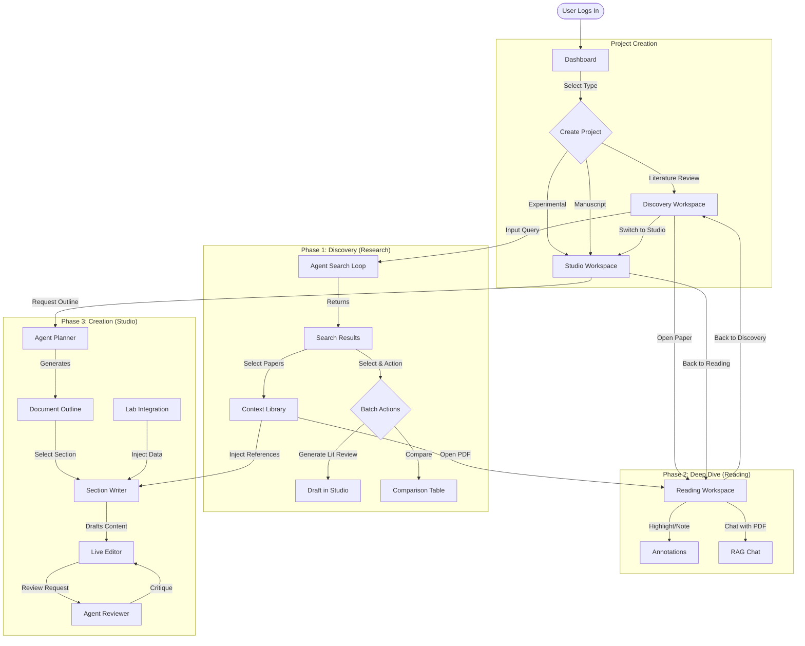

# ScholarFlow User Journey

This document outlines the user's flow through the ScholarFlow application, detailing the interactions in each workspace and how they connect to the backend agent.

## 1. User Logic Flow

## 2. Detailed Journey Steps

### Step 1: Dashboard & Initialization
The user begins at the **Dashboard**, the central hub for all research products.
*   **Actions:**
    *   **Start New:** User selects a template (`Literature Review`, `Experimental Paper`, `General Manuscript`).
    *   **Resume:** User clicks a recent project card to return to their last state.
*   **System Action:**
    *   Initializes the `ProjectStore` and `AgentStore`.
    *   Sets the `AppMode` (Research vs. Studio) based on the project type.

### Step 2: Discovery Workspace (The Search Phase)
Used primarily for `Literature Review` projects. The user interacts with the **Research Agent**.
*   **User Action:** Types a natural language query (e.g., "Impact of transformers on NLP efficiency").
*   **System Action:**
    *   **Router Node** identifies intent as `SEARCH`.
    *   **Search Node** queries ArXiv/Semantic Scholar.
    *   **Ranker Node** evaluates results and filters irrelevant papers.
*   **User Interaction:**
    *   **View Results:** Cards appear with titles, authors, and summaries.
    *   **Select Papers:** User clicks cards to select them.
    *   **Add to Context:** Selected papers are saved to the project (`LibraryItem`), making them available for RAG (Retrieval Augmented Generation).
    *   **Batch Action:** User clicks "Generate Lit Review" to instantly create a project from selected papers.

### Step 3: Reading Workspace (The Learning Phase)
When a user clicks a paper, they enter the **Reading Mode**.
*   **User Action:** Scrolls through the PDF (rendered via `react-pdf`).
*   **Tools:**
    *   **Highlighting:** Select text to highlight or copy.
    *   **Zoom/Nav:** Standard controls.
    *   **Add to Context:** If not already added, user can click "Add Context" to promote this paper for the Agent's use.
*   **Agent Interaction:**
    *   (Future) "Chat with Paper": User can ask specific questions about the open PDF, triggering a focused RAG search on just that document.

### Step 4: Studio Workspace (The Writing Phase)
The **Co-Authoring Interface**. This is a split-screen view with the Document Editor (Left) and Agent Chat (Right).
*   **Editor Interface:**
    *   **Visual Mode:** A WYSIWYG-like experience that mimics a PDF page layout (A4). Blocks are editable individually.
    *   **Source Mode:** Full Markdown/LaTeX source code editing with `Monaco Editor`.
    *   **Templates:** User can switch designs (e.g., IEEE vs. Springer) instantly.
*   **Agent Interaction (Co-Author):**
    *   **Plan:** User asks "Create an outline for this topic." -> `Planner Node` runs.
    *   **Write:** User highlights a section header and clicks "Write this section." -> `Writer Node` uses the *Context Library* + *Lab Data* to generate academic text.
    *   **Review:** User asks "Review my abstract." -> `Reviewer Node` checks for clarity, tone, and citation correctness.

### Step 5: Lab Integration
For `Experimental Papers`, user flows include data ingestion.
*   **User Action:** Uploads a CSV or Chart Image in the "Assets" modal.
*   **System Action:**
    *   **Lab Analyst Node:** Uses Gemini Vision to "see" the chart or Python to analyze the CSV.
    *   **Result:** A textual summary of the data (e.g., "Figure 1 shows a 40% increase in accuracy") is generated and injected into the Writer's context.

---

## 3. Key Interactions Map

| User Action | Frontend Component | Backend Node Triggered | Output |
| :--- | :--- | :--- | :--- |
| **"Find papers on X"** | `WorkspaceDiscovery` | `Search` -> `Ranker` | List of `Paper` cards |
| **"Select & Generate"** | `WorkspaceDiscovery` | `Planner` | New Project with `Draft` |
| **"Compare selected"** | `WorkspaceDiscovery` | `Analyst` | Markdown Comparison Table |
| **"Write Section"** | `WorkspaceStudio` | `Writer` | Text block appended to editor |
| **"Review Draft"** | `WorkspaceStudio` | `Reviewer` | Critique/Feedback in Chat |
| **"Upload Chart"** | `App` (Modal) | `Lab Analyst` | Text description of image |
